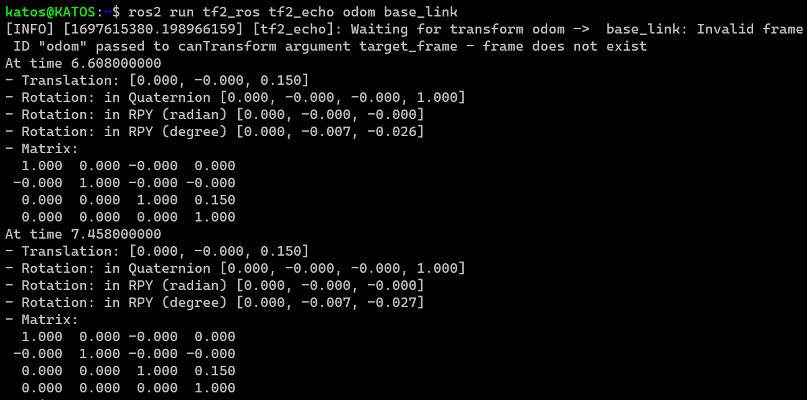
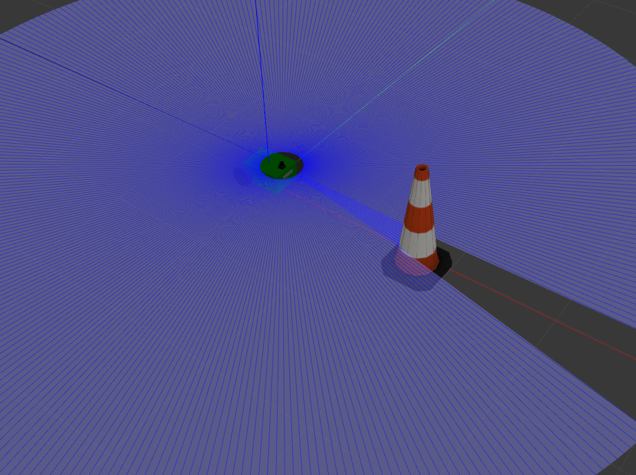
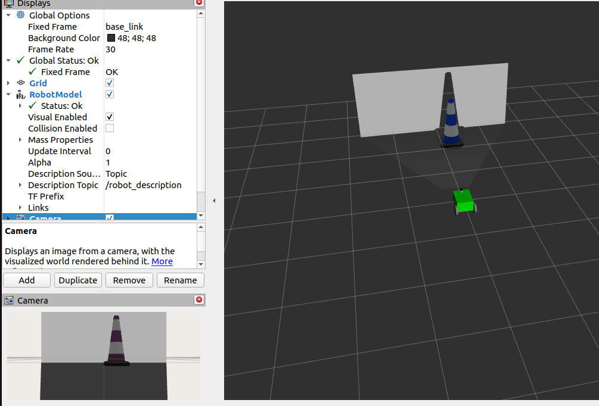
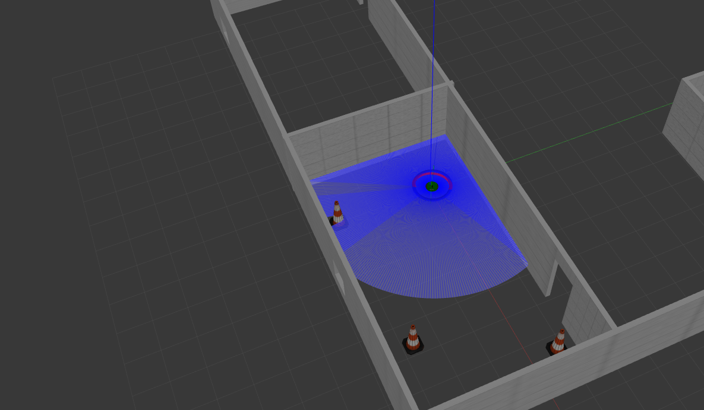
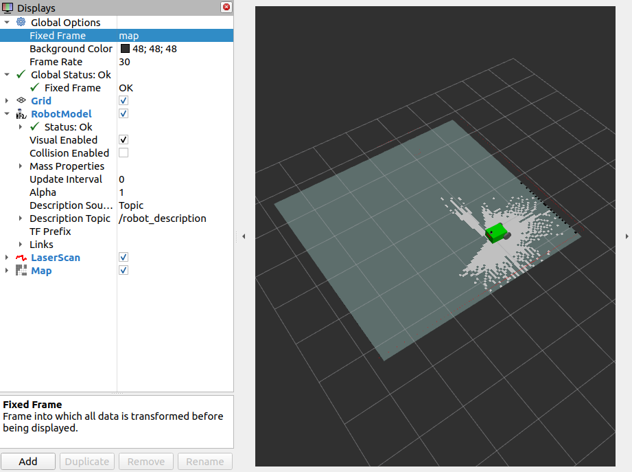
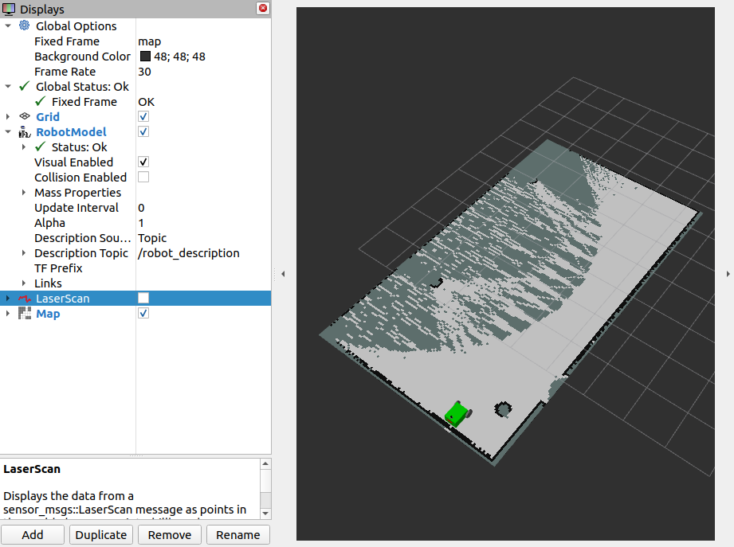
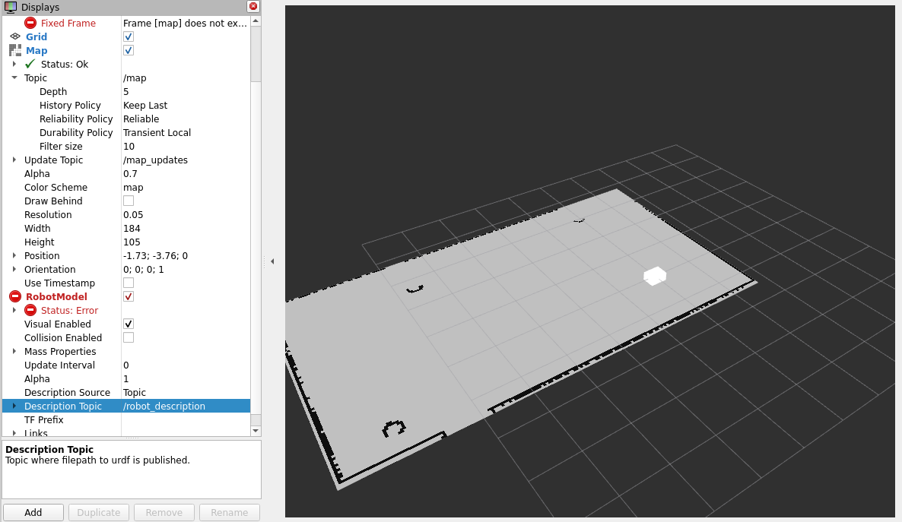
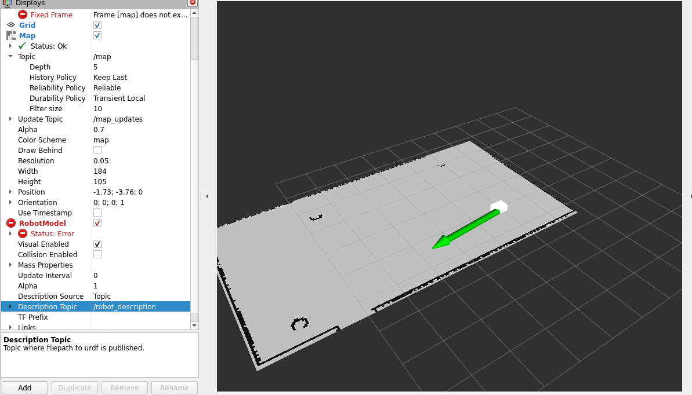
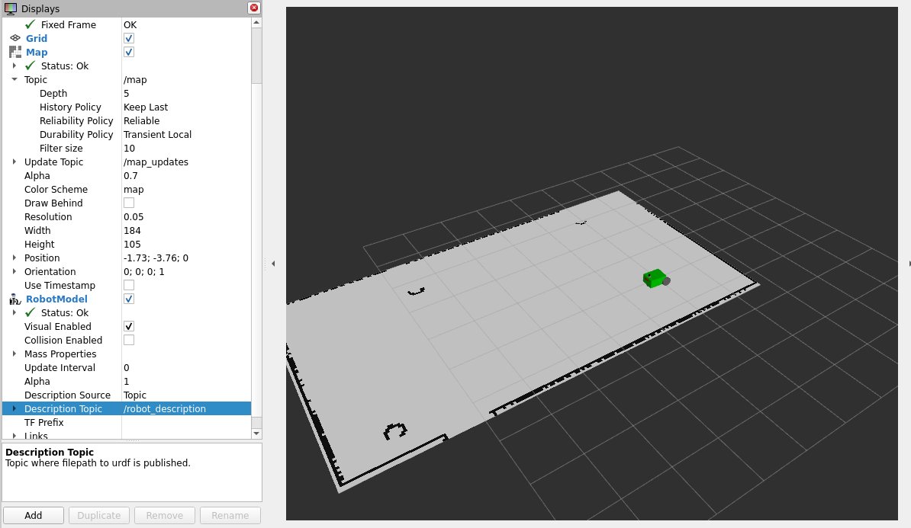
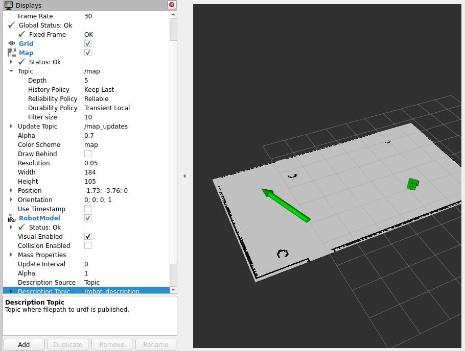

# Create an autonomous differential drive robot.
In this tutorial we will walk through some interest part of robotics. We will add sensors to our models such as lidar, a depht camera and an imu.
We will use the nav2 package to navigate, to avoid obstacles and create paths. Also we will localize our robot and finally the robot will be able to create his own map. Finally the map will be saved and re-used.

You can find a presentation that will guide you through this tutorial. In the presentation, you can find information on how to build this robot.
- [Use nav2 package to your robot]() Greek launguage.
- [Use nav2 package to your robot]() English language(comming soon)

More information about the Nav2 package can be found [here](https://navigation.ros.org/index.html).

Before starting creating the robot model and all the necessery components, ensure you have install some packages. Run the next commands.
```
sudo apt install ros-humble-robot-localization
sudo apt install ros-humble-navigation2  
sudo apt install ros-humble-nav2-bringup
sudo apt install ros-humble-turtlebot3-gazebo
```

## Create package and a URDF robot model.

First of we will create a new ros package
```
cd ~/ros2_ws/src
ros2 pkg create --build-type ament-python robot_loc_nav
```
Create folder for better organization in the package.
```
cd ~/ros2_ws/src/
mkdir launch urdf meshes worlds
```
After creating the package and the folders, you must informes the setup.py file of the package.
Add the following modules to the python script
```py
import os
from glob import glob
```

Now the data_file list must be informed. So add the following to the list.
```py
        (os.path.join('share',package_name,'launch'),
         glob(os.path.join('launch','*.launch.py'))),
        (os.path.join('share',package_name,'urdf'),
         glob(os.path.join('urdf','*.xacro'))),
         (os.path.join('share',package_name,'urdf'),
         glob(os.path.join('urdf','*.gazebo'))),
        (os.path.join('share',package_name,'worlds'),
         glob(os.path.join('worlds','*.world'))),
        (os.path.join('share',package_name,'meshes'),
         glob(os.path.join('meshes','*.dae'))),
        (os.path.join('share',package_name,'config'),
         glob(os.path.join('config','*.yaml'))),
        (os.path.join('share',package_name,'maps'),
         glob(os.path.join('maps','*.yaml'))),
        (os.path.join('share',package_name,'maps'),
         glob(os.path.join('maps','*.pgm'))),
        (os.path.join('share',package_name,'rviz'),
         glob(os.path.join('rviz','*.rviz'))),
```

Now build the package using the colcon tool.
```
cd ~/ros2_ws/
colcon build --packages-select robot_loc_nav
```

For the two wheel robot model we use many xacro features to make easier the contruction of the robot. Create a new file in the urdf file with the name [robot_loc_nav.xacro](https://github.com/DimitrisKatos/robot_loc_nav/blob/master/urdf/robot_loc_nav.xacro). We also create [my_robot.gazebo](https://github.com/DimitrisKatos/robot_loc_nav/blob/master/urdf/my_robot.gazebo) file where we define the color of every link and we enable the differential drive control for Gazebo simulator.

One difference from the [dd_robot](https://github.com/DimitrisKatos/dd_robot) and [my_robot](https://github.com/DimitrisKatos/my_robot) tutorials is one extra link in robot model. We need to add footprint for the robot because many algorithms in Nav2 package use it for navigating through the workplace of the robot.
```xml
<!-- Robot Footprint -->
    <link name="base_footprint">
        <xacro:default_inertia_boxes mass="0" width="0" depth="0" height="0"/>
    </link>

    <joint name="base_joint" type="fixed">
        <parent link="base_link"/>
        <child link="base_footprint"/>
        <origin xyz="0.0 0.0 ${-(radius+0.05)}" rpy="0 0 0"/>
    </joint>

```

Now you can visualize the robot in Rviz and Gazebo. Create a new lanch file [display.launch.py](https://github.com/DimitrisKatos/robot_loc_nav/blob/master/launch/display.launch.py). Then build the pakage and start the launch file.

## Robot Localization. 

Locating the robot at its workplace is very important for an autonomous robotic system. Two sensors are primarily used to locate the robot. These are the odometry sensors and imu sensors. The odometry sensor has been activate from the differential drive control plugin for Gazebo. For imu sensor, we need to add a new link to robot model and finally activate the sensor by adding a new Gazebo plugin. 

In your two wheel robot add the following XML code
```xml
<!-- imu link-->
    <link name="imu_link">
        <visual>
            <geometry>
                <box size="0.1 0.1 0.1"/>
            </geometry>
        </visual>
        <collision>
            <geometry>
                <box size="0.1 0.1 0.1"/>
            </geometry>
        </collision>
        <xacro:default_inertia_boxes mass="0.1" width="0.1" depth="0.1" height="0.1"/>
    </link>

    <joint name="imu_joint" type="fixed">
        <parent link="base_link"/>
        <child link="imu_link"/>
        <origin xyz="0 0 0.01"/>
    </joint>

    <!-- Camera Link-->
    <link name="camera_link">
        <visual>
            <origin xyz="0 0 0" rpy="0 0 0"/>
            <geometry>
                <box size="0.015 0.130 0.022"/>
            </geometry>
        </visual>

        <collision>
            <origin xyz="0 0 0" rpy="0 0 0"/>
            <geometry>
                <box size="0.015 0.130 0.022"/>
            </geometry>
        </collision>

        <inertial>
            <origin xyz="0 0 0" rpy="0 0 0"/>
            <mass value="0.035"/>
            <inertia ixx="0.001"  ixy="0"  ixz="0" iyy="0.001" iyz="0" izz="0.001" />
        </inertial>
    </link>
```

For activation of the imu sensor, we create a new file in the urdf file. The name of this file is [imu.gazebo](https://github.com/DimitrisKatos/robot_loc_nav/blob/master/urdf/imu.gazebo) and here we activate the plugin for the robot model. Finally, in the robot_loc_nav.xacro we use the xacro include feature to import the imu.gazebo to the robot model.
After succesfully add the imlu sensor, we move forward to localize the robot model. In the config folder, create the [ekf_filter.yaml](https://github.com/DimitrisKatos/robot_loc_nav/blob/master/config/ekf_filter.yaml) file. In this file we define the parameters which the localization we start.

Now update the [display.launch.py](https://github.com/DimitrisKatos/robot_loc_nav/blob/master/launch/display.launch.py) file by adding the following.
```py
sim_time= DeclareLaunchArgument(name='use_sim_time', default_value='True',
                                   description='Flag to enable use_sim_time')

robot_localization_node = Node(
       package='robot_localization',  executable='ekf_node',
       name='ekf_filter_node', output='screen',
       parameters=[os.path.join(robot_path, 'config/ekf_filter.yaml'), 
{'use_sim_time': LaunchConfiguration('use_sim_time')}])
```

In the LaunchDescription add robot_localization. Build the package and launch the Rviz and gazebo. Run the next command and you will see the location of the robot base on the two sensors.


## Robots mapping
Mapping is very important for the robots. The map of the robot is vital because of the fact that we the knownledge of the workplace can make many tasks. Mapping can be created by the distance measurements sensors such as depth camers and lidars. In the [my_robot](https://github.com/DimitrisKatos/my_robot) tutorial we have added a lidar, so for more information on how to setup lidar can be found in this tutorial. 

Now we move forward on adding a depth camera to the robot. Add new link in robot model for the camera:
```xml
 <!-- Camera Link-->
    <link name="camera_link">
        <visual>
            <origin xyz="0 0 0" rpy="0 0 0"/>
            <geometry>
                <box size="0.015 0.130 0.022"/>
            </geometry>
        </visual>

        <collision>
            <origin xyz="0 0 0" rpy="0 0 0"/>
            <geometry>
                <box size="0.015 0.130 0.022"/>
            </geometry>
        </collision>

        <inertial>
            <origin xyz="0 0 0" rpy="0 0 0"/>
            <mass value="0.035"/>
            <inertia ixx="0.001"  ixy="0"  ixz="0" iyy="0.001" iyz="0" izz="0.001" />
        </inertial>
    </link>

    <joint name="camera_joint" type="fixed">
        <parent link="base_link"/>
        <child link="camera_link"/>
        <origin xyz="0.215 0 0.05" rpy="0 0 0"/>
    </joint>

    <link name="camera_depth_frame"/>
    <joint name="camera_depth_joint" type="fixed">
        <origin xyz="0 0 0" rpy="${-pi/2} 0 ${-pi/2}"/>
        <parent link="camera_link"/>
        <child link="camera_depth_frame"/>
    </joint>
```

Activate the depth camera by creating a new gazebo plugin and then import it to the robot model. Create [depth_camera.gazebo](https://github.com/DimitrisKatos/robot_loc_nav/blob/master/urdf/depth_camera.gazebo) and use xacro include method.
Run the next command to visualize the depth camera.
```
cd ~/ros2_ws
colcon build --packages-select robot_loc_nav 
export LIBGL_ALWAYS_SOFTWARE=1 LIBGL_ALWAYS_INDIRECT=0
ros2 launch robot_loc_nav display.launch.py
```
When Gazebo starts, add an obstacle in front of the robot. In Rviz, add the robot model and PointCloud.




Let's move forward on creating a map for the robot. Create a new configuration file for slam toolbox. In the config file create the [nav2_params.yaml]() file. Now run the next commands.
```
cd ~/ros2_ws
colcon build --packages-select robot_loc_nav 
export LIBGL_ALWAYS_SOFTWARE=1 LIBGL_ALWAYS_INDIRECT=0
ros2 launch robot_loc_nav display.launch.py
```
Move to a new terminal and run the following.
```
ros2 launch slam_toolbox online_async_launch.py params_file:=src/robot_loc_nav/config/nav2_params.yaml use_sim_tim:=true
```

In Rviz, add the robot model and Map feature. In simulator put the robot in a building and you can see that the robot is starting creating a map of his workplace.






## Reusing the map 

The map is very important for the robot. But creating map every time is difficult for the robot's computer. That's the reason why we want to save this map and reuse it any time.
For saving the map we will use the SlamToolboxPlugin. Select Panels from window settings and the Add panel. From the new gui select SlamToolboxPlugin.

Now you can notice a new plugin in Displays Panel. In Serial Map give the name my_map and saved it. After saving the map, create the map folder in your package. Move all the map files to this folder. Now you must update the setup.py file by adding some paths to data_files.
```py
(os.path.join('share',package_name,'maps'),
         glob(os.path.join('maps','*.yaml'))),
(os.path.join('share',package_name,'maps'),
         glob(os.path.join('maps','*.pgm'))),
```

Also run the next commands
```
cd ~/ros2_ws/src/robot_loc_nav
cp /opt/ros/humble/share/nav2_bringup/laumch/navigation_launch.py launch/
cp /opt/ros/humble/share/nav2_bringup/laumch/localization_launch.py launch/
cp /opt/ros/humble/share/nav2_bringup/params/nav2_params.yaml config/
```

Now run the next command to reuse the map.
```
cd ~/ros2_w
colcon build --packages-select robot_loc_nav
export LIBGL_ALWAYS_SOFTWARE=1 LIBGL_ALWAYS_INDIRECT=0
ros2 launch robot_loc_nav display.launch.py 
        # Open new terminal
cd src/robot_loc_nav
ros2 launch robot_loc_nav localization.launch.py  map:= /maps/my_map.yaml  
```
In rviz add the map feature and you will see the following.



When we launching the map in Rviz, the robot have no idea where he is this map. Select the **2D Pose Estimat** and give him the starting position. Now you will see the following.



After giving the starting position the robot model we be appeared and know he will know where he is in the map.



## Autonomous driving
After launching the map and define the starting position of the robot you can give a desired position to the robot.
Run the following command to a new terminal. 
```
ros2 launch robot_loc_nav navigation.launch.py use_sim_time:=true
```

Selesct the **2D Goal Pose** and give a desired position.



After that the robot will create a path to this position and start moving. On his road to achieve his goal the robot is capable of avoiding all the obstacles even those he doesn't know that exist.
